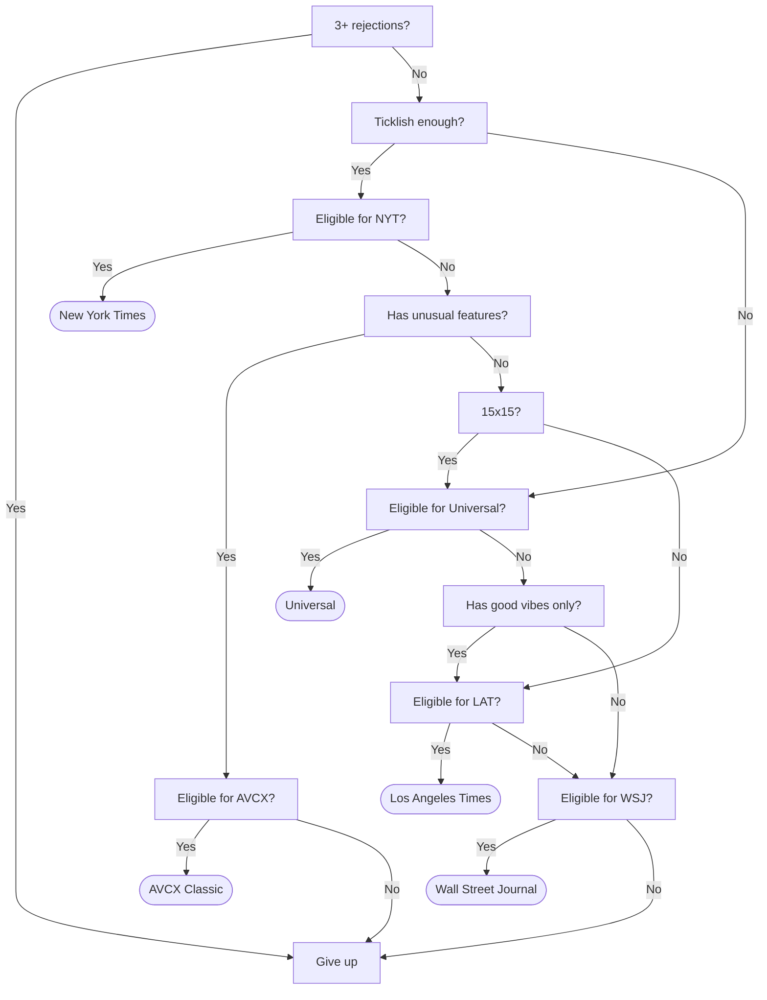

# Venue Decision Flowchart

```mermaid
flowchart TD
    
    fifteenbyfifteen[15x15?]
    goodvibes[Has good vibes only?]
    giveup[Give up]
    rejections[3+ rejections?]
    ticklish[Ticklish enough?]
    unusual[Has unusual features?]

    avcx([AVCX Classic])
    avcxeligible[Eligible for AVCX?]
    lat([Los Angeles Times])
    lateligible[Eligible for LAT?]
    nyt([New York Times])
    nyteligible[Eligible for NYT?]
    universal([Universal])
    universaleligible[Eligible for Universal?]
    wsj([Wall Street Journal])
    wsjeligible[Eligible for WSJ?]

    rejections -- Yes ---> giveup
    rejections -- No --> ticklish
    ticklish -- Yes --> nyteligible
    ticklish -- No --> universaleligible
    nyteligible -- Yes --> nyt
    nyteligible -- No --> unusual
    unusual -- Yes --> avcxeligible
    unusual -- No --> fifteenbyfifteen
    avcxeligible -- Yes --> avcx
    avcxeligible -- No ---> giveup
    fifteenbyfifteen -- Yes --> universaleligible
    fifteenbyfifteen -- No --> lateligible
    universaleligible -- Yes --> universal
    universaleligible -- No --> goodvibes
    goodvibes -- Yes --> lateligible
    goodvibes -- No --> wsjeligible
    lateligible -- Yes --> lat
    lateligible -- No --> wsjeligible
    wsjeligible -- Yes --> wsj
    wsjeligible -- No ---> giveup
```
